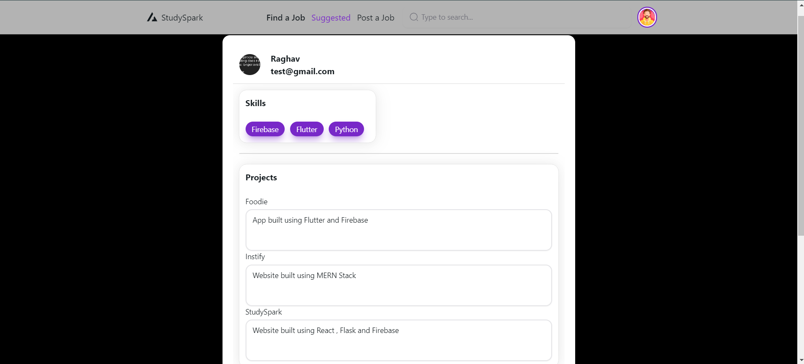
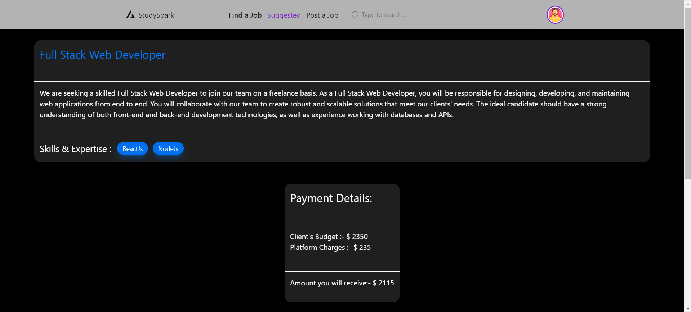

# StudySpark

**StudySpark** is a unique freelancing platform tailored specifically for students, allowing them to offer and request services. In this platform, students can act as both **freelancers** and **clients**, making it a dynamic space for collaboration and learning. 

The platform supports dynamic pricing based on service type, project complexity, and deadlines. Services range from website development to app building, documentation, and design.

## Features

- **Freelancer & Client Roles**: Students can seamlessly switch between being a freelancer and a client within the same account.
- **Dynamic Pricing**: The platform adjusts pricing based on:
  - Service Type (Frontend, Backend, Figma, etc.)
  - Deadline Urgency
  - Complexity of the project
- **Wide Range of Services**:
  - **Frontend Development**
  - **Backend Development**
  - **Full Stack Websites**
  - **Figma Designs**
  - **Documentation & Presentations (Docs, PPT)**
  - **Mobile App Development**
- **User-Friendly Dashboard**: Clients and freelancers can track project status, communicate in real time, and manage deadlines.
- **Rating & Feedback System**: Clients can rate freelancers based on their performance, helping others to make informed decisions.

## Tech Stack

- **Firebase**: For user authentication, real-time database, and cloud storage.
- **Express.js**: Backend framework to handle API requests, user authentication, and project management.
- **React.js**: Frontend framework used to build the interactive user interface.
- **Node.js**: Backend runtime to handle server-side logic.
- **Firebase Firestore**: For handling data storage and queries.
- **Firebase Authentication**: Secure authentication system to manage user sessions.

## Installation and Setup

To set up the project locally:

1. **Clone the repository**:
   ```bash
   git clone https://github.com/yourusername/StudySpark.git
   cd StudySpark
   ```
2. **Install dependencies:**
   ```bash
   npm i
   ```
3. ***Create a .env file in the backend folder and add the following:***
  ```bash
    FIREBASE_API_KEY=<your-firebase-api-key>
    FIREBASE_AUTH_DOMAIN=<your-firebase-auth-domain>
    FIREBASE_PROJECT_ID=<your-firebase-project-id>
    FIREBASE_STORAGE_BUCKET=<your-firebase-storage-bucket>
    FIREBASE_MESSAGING_SENDER_ID=<your-firebase-messaging-sender-id>
    FIREBASE_APP_ID=<your-firebase-app-id>
    PORT=5000
  ```
4. ***Start the frontend development server***
   ```bash
   npm start
   ```
5. Visit `http://localhost:3000` to view the app.

## Screenshots

Here are some screenshots of **StudySpark** in action:

### Profile


### Homepage


### Job Description


### Service Selection


